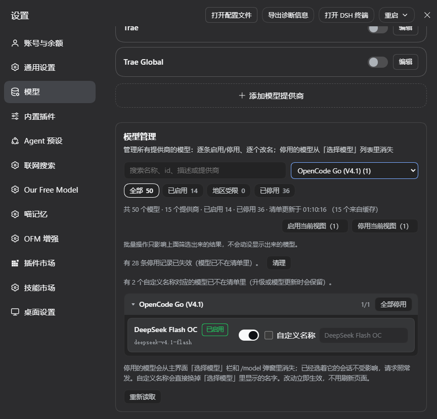
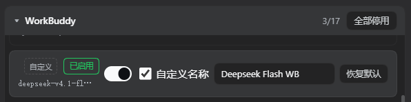

# dsh-ofm-model-manager

**English** | [中文](README.zh.md)

   

> **Per-model enable/disable and renaming for every provider in DeepSeek Harness.**
> Adds a panel at the bottom of **Settings → Models** that toggles each model of each provider and gives it a custom display name.

- Disable a model → it disappears from the composer's model picker and the `/model` dialog. A provider whose models are all disabled disappears from the picker as a group.
- Give it a custom name → the picker shows your name instead of the built-in one. The model id is untouched.
- Preferences live in the profile and apply **immediately** — no page reload, no DSH restart.

*The panel at the bottom of Settings → Models: search box, status chips and provider filter on top, per-provider groups with per-model switches and custom names below.*

*A row with "custom name" enabled — switch, checkbox, name field and "restore default".*

---

## Install

One line from GitHub:

`sh
dsh plugin --profile desktop add github:DeepseekDays/dsh-ofm-model-manager
`

(use your own profile name instead of `desktop` if different). Then **fully quit DSH, tray included, and start it again** — new bundles are read at startup.

From a checkout, `node install.mjs` does the same with a directory junction and **without running pnpm** (running pnpm while DSH is live rebuilds `node_modules` and can interrupt a running session):

`powershell
node install.mjs                 # default: desktop profile
node install.mjs --profile web   # another profile
node install.mjs --dry           # show what would change
node install.mjs --uninstall     # remove junction + both manifest entries, keep the folder
`

It backs up `<profile>/package.json` before touching it.

## What the panel gives you

| Control | Scope |
| --- | --- |
| Search box | exact match on name, custom name, model id, description, provider name |
| Status chips | All / Enabled / Region-restricted / Disabled, each with a count |
| Provider dropdown | one route at a time, with its model count |

The three are ANDed. Rows are grouped by **provider**, and each group header shows `name · enabled/total` plus a group-level switch ("enable all" when everything is off, otherwise "disable all"). Groups collapse; collapsing is render-only and does not change filtering or counts.

Batch buttons act on **the current view** (the filtered result) and say so in small print underneath — there is deliberately no silent "select the whole catalog".

Each row is `effective name + status badge / model id / description`, followed by switch → "custom name" checkbox → name field (disabled until the checkbox is on, showing the built-in name). A **custom** tag marks rows that use a custom name; a **wildcard** tag marks names that apply to every provider (see below).

Long lists render 40 rows at a time with a "show more (N left)" button, and the budget resets whenever the filter changes — no virtual-scrolling library, this is a hand-written ModuleLoader bundle.

Empty and error states are explicit: nothing listed at all, everything disabled (with a one-click "enable all"), no search results (echoing the keyword), plus a read failure state with a retry and a write failure state that rolls back.

## Requirements and compatibility

- A DSH that provides the `settings.models.footer` slot and `@deepseek-ai/dsh-client-ui-primitives`@ (tested against ``deepseek-ai/dsh` 0.2.0-rc.2).
- Declares `dsh.bundle` in `package.json`, so it installs with plain `dsh plugin add`.
- **No kernel files are modified.** The plugin wraps `ctx.llm.listModels()` at runtime and restores it on unload (reference-counted).
- **Coexists with `dsh-provider-toggle`** (provider-level switching). Both wrap the same own property on the llm instance; providers-level unloading deletes it, so this plugin re-installs its wrapper on the next config read whenever the own property has disappeared entirely — and deliberately does not stack a second wrapper when someone else merely wrapped it again.
- **Unaffected by plugins that inject models deeper down** (e.g. pi-ai `getModels`): filtering happens at the `listModels` exit, so injected models are managed and displayed like any other.
- Runtime dependencies: **none**.

## Preference keys

`
provider|modelId     only that model on that route
modelId              no separator = every provider (wildcard)
`

Why this shape: model ids repeat across providers (`deepseek-v4.1-flash` exists under several), so a bare-id key silently disabled all of them — v2 keys carry the provider. Bare ids from v1 config read as wildcards, so **v1 configuration keeps working with zero migration**. One field with one element type keeps the schema trivial, and the pipe is a plain character that YAML does not need to quote, so keys stay readable inside `cordis.patch.yml`.

**Exact key beats wildcard key**, so "rename for everyone" and "rename this one specifically" can coexist. The panel only ever writes exact keys; wildcards come from v1 config or a hand-edited file, and are shown as a **wildcard** tag in the UI.

## Development

`sh
node test/all.mjs
`

Four offline suites — no DSH, no network, no browser:

| File | Covers |
| --- | --- |
| `test/manager.test.mjs` | pure logic: key format, wildcard/exact precedence, route claim, catalog merge, three states, search, TTL cache |
| `test/host.test.mjs` | `apply()` against a fake ctx: does a disabled model really leave the catalog, is the panel's read-only endpoint still served, broadcast, trust gate, shared patch slot with `provider-toggle` |
| `test/client.test.mjs` | loads `client.js` through the ModuleLoader protocol and **really renders** the panel with a minimal React stand-in: grouping, counts, collapsing, empty states, batch scope, partial rendering, write shape and rollback |
| `test/manifest.test.mjs` | manifest consistency: package name, bundle, slot, field names, separator, self-containment |

The suites re-implement the expected behaviour (they replicate DSH's `groups.filter(group => group.models.length > 0)` rather than calling the code under test) so they cannot pass by agreeing with themselves.

## Troubleshooting

| Symptom | Cause / fix |
| --- | --- |
| Panel does not appear | the bundle was not loaded — check `dsh.profile.bundles` in the profile `package.json`, then fully quit DSH (**tray included**) and start again |
| "cannot read this plugin's settings namespace" | same as above; also check that the entry `id` in `cordis.patch.yml` matches the injected namespace |
| The switch seems to do nothing | the wrapper was removed when another plugin unloaded. It is re-installed on the next config read; restart DSH if it persists |
| No name field | the host half is still v1 (no `names` field in the namespace) — fully restart DSH |
| Picker did not change after renaming | wait for the 500 ms write debounce, then look for a failed `settings.mutate` in the console |
| Panel flickers while typing | fixed (see limit 8). A browser-half hot reload is enough; if it persists, look for this plugin's `listener failed` or `settings/conflict` |
| Start from scratch | delete the `config` of the `id: dsh-ofm-model-manager` entry in the profile's `cordis.patch.yml` |

## Known limits

1. **Disabling affects the catalog, not routing.** A session already using the model keeps working; new sessions simply cannot pick it. That is the kernel's behaviour and this plugin does not change it.
2. **Renaming only changes the display name**, never the model id — config, session logs and credential references keep the original id.
3. **Provider-level switching is not taken over**: that is `dsh-provider-toggle`'s job. Both can be installed and active at once.
4. **Settings are written as one whole volatile form**, so preferences are last-writer-wins; two tabs editing at once get a `settings/conflict` (the panel reports it and rolls back rather than dropping data silently).
5. **Wildcard keys are a global broadcast** — tagged in the UI so "I changed one model, why did everything change" cannot happen unnoticed.
6. **Partial rendering instead of virtual scrolling**: more than 40 rows need "show more"; filtering is the intended tool for long catalogs.
7. **The read-only endpoint lives under `/api/ofm-model-manager`** (longer prefix than the kernel's `/api`, and the web server prefers the longest prefix, so it runs ahead of connection's own admission check) — hence its own equivalent trust gate (loopback host, cross-site fetch refused, same-origin Origin/Referer), preferring the `connection` service's admission check when the composition provides it.
8. **Renaming does not lock or repaint the panel**: name writes use a separate path that never sets `busy` (otherwise every row's checkbox would grey out and back while you type), and only fields the UI actually renders trigger a repaint (`RENDER_KEYS` in `client.js`). Accounting-only fields are excluded — add new fields to `RENDER_KEYS` or their updates will silently not repaint (there is a case pinning this).
9. **On hot-reload the pending debounced write is flushed before the old instance hands over** (`clearTimeout` then an immediate `flushNames()`), so what you typed in the last 500 ms survives an HMR swap instead of being written from stale state.

The Chinese README ([README.zh.md](README.zh.md)) documents the implementation in more depth: how the catalog is filtered, why disabling the last model of a route removes the whole group, the read-only endpoint's trust gate, the optimistic-update and rollback path, and the transition state between a hot-reloaded browser half and a not-yet-restarted host half.

## Files

`
index.js            host half: catalog filtering + read-only endpoint + state
client.js           browser half: the Settings panel
src/manager.js      pure logic: key format, catalog merge, cache, search
src/trust.js        trust gate for the read-only endpoint
cordis.patch.yml    bundle declaration
install.mjs         install / uninstall / dry run
test/               offline suites
assets/             screenshots used by this README
`

## License

MIT — see [LICENSE](LICENSE).
